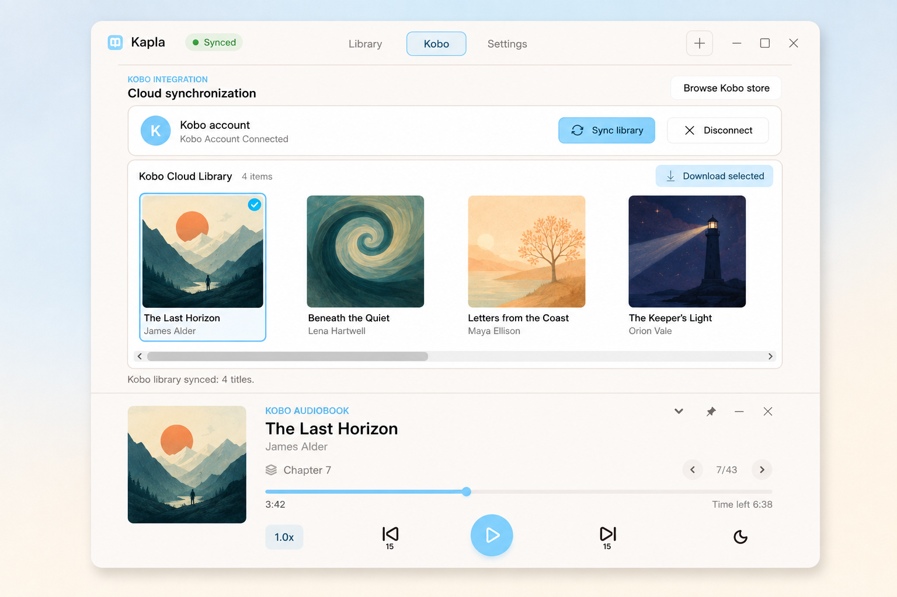

<p align="center">
  
</p>

<h1 align="center">Kapla</h1>

<p align="center"><strong>Your Kobo audiobooks. Your Windows desktop.</strong></p>

<p align="center">
  A small, focused audiobook player for listening to your Kobo library on Windows.
</p>

<p align="center">
  <a href="https://github.com/azijnwater/Kapla/releases/latest">Download Kapla</a> ·
  <a href="https://github.com/azijnwater/Kapla/issues">Report an issue</a>
</p>

## What you need

You need a Kobo account with an audiobook in its library. That can be:

- an audiobook you bought or redeemed with a Kobo audiobook credit; or
- an eligible audiobook from Kobo Plus Listen or Kobo Plus Read & Listen, the combined audiobook and eBook subscription.

Not every Kobo title is downloadable outside Kobo's official apps. Kapla only shows and imports audiobooks that Kobo makes available to your account in a playable format.

## What Kapla does

- Plays your available Kobo audiobooks in a compact Windows player.
- Remembers your listening position.
- Shows chapters, cover artwork, and book details.
- Supports playback speed, skipping, volume, sleep timers, and Windows media controls.
- Can also play audiobook files you already own in M4B, M4A, MP3, or AAC format.

## Install

1. Download the latest portable ZIP from [GitHub Releases](https://github.com/azijnwater/Kapla/releases/latest).
2. Extract it to a folder.
3. Open `Kapla.exe`.

Kapla requires 64-bit Windows 10 or later with .NET Framework 4.8. It does not need an installer.

## Connect Kobo

1. Expand Kapla and open the **Kobo** tab.
2. Choose **Connect Kobo**.
3. Kapla opens Kobo's activation page and shows a short code with clear instructions.
4. Sign in to Kobo in your browser, enter the code, then return to Kapla.

Your password is entered only on Kobo's website. Kapla never sees or stores it.

## This is not a piracy tool

Kapla does not crack Kobo DRM, decrypt protected app storage, unlock books you do not have access to, or turn Kobo audiobooks into freely shareable files.

It only requests titles from your own Kobo account and imports a title when Kobo provides an authorized playable download. Protected titles remain available through Kobo's official apps. Use Kapla only for audiobooks and files you are allowed to access.

## Privacy

Your settings, library, listening position, downloaded media, and encrypted Kobo session stay on your PC. Disconnecting Kobo removes the saved Kobo session from Kapla.

## Build from source

On Windows with the .NET Framework 4.8 developer tools:

```powershell
.\Tests\run-tests.ps1
.\build.ps1
```

See [CONTRIBUTING.md](CONTRIBUTING.md) for contribution guidance and [SECURITY.md](SECURITY.md) for security details.

## License

Kapla is free and open source under the [MIT License](LICENSE). It is an independent project and is not affiliated with or endorsed by Kobo.
