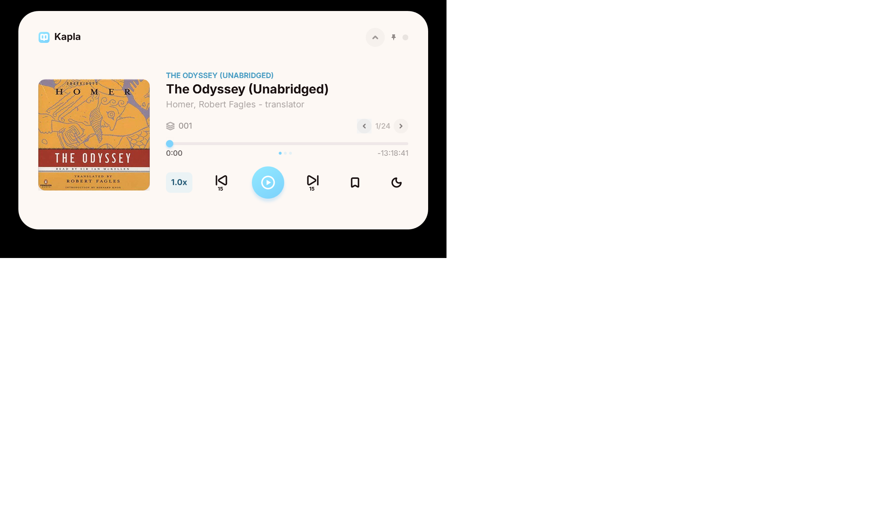

<p align="center"></p>

# Kapla

Kapla is a compact, native Windows audiobook player for listening to authorized Kobo downloads and keeping supported listening progress in sync.

## Features

- Small resizable player with connected library, Kobo, settings, and sleep-timer views
- Chapter navigation and chapter-relative or whole-audiobook progress
- Light and dark themes, optional cover artwork, playback speed, and configurable skip controls
- Kobo library browsing, concurrent downloads with progress, metadata, covers, and automatic progress sync
- Native WPF playback with no browser runtime or emulator

## Download

Download the newest portable ZIP from [GitHub Releases](https://github.com/azijnwater/Kapla/releases/latest). Builds are currently unsigned.

## Installation

1. Extract `Kapla-<version>-windows-x64-portable.zip`.
2. Run `Kapla.exe` or `Launch-Kapla.cmd`.
3. Windows 10 or later with .NET Framework 4.8 is required.

## Connecting Kobo

Open Kapla, expand the top section, choose **Kobo**, and select **Connect**. Kapla uses Kobo's device-activation flow; account-session data is encrypted for the current Windows user with Windows DPAPI. After activation, library and supported progress updates synchronize automatically.

## Local audiobooks

The **+** view can also add M4B, M4A, MP3, and AAC files you already own. Kapla reads embedded title, author, artwork, duration, and chapter metadata when present.

## Building from source

On Windows with the .NET Framework 4.8 developer tools:

```powershell
.\Tests\run-tests.ps1
.\build.ps1
```

The executable and assets are written to `outputs`. Run `.\package-release.ps1` to produce the versioned portable ZIP and SHA-256 checksum locally.

## Privacy and security

Settings, library data, authorized downloads, and the encrypted Kobo session are stored under `%LOCALAPPDATA%\KoboNativePlayer`. Credentials, account data, and downloaded books are not part of this repository.

## Known limitations

Kobo does not provide Kapla with a stable public desktop audiobook SDK. Imports and progress sync work only when the account services return an authorized playable manifest and accept the progress endpoint. DRM-protected titles that do not expose such a manifest remain available through Kobo's official apps.

## Contributing

See [CONTRIBUTING.md](CONTRIBUTING.md) for the development workflow and [SECURITY.md](SECURITY.md) for private vulnerability reports.

## License

No open-source license has been selected yet. Unless a license is added, the repository remains copyright-protected and does not grant redistribution or modification rights.

Kapla is an independent project and is not affiliated with or endorsed by Kobo. See [NOTICE.md](NOTICE.md) for bundled asset and trademark notes.
